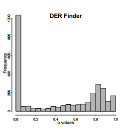
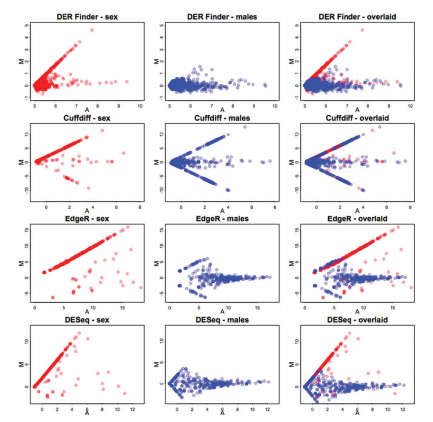

## Differential expression analysis of RNA-seq data at single-base resolution

Authors: Alyssa Frazee, Sarven Sabunciyan, Kasper Hansen, Rafael Irizarry and Jeffrey Leek

Outline of talk:

- Introduction/motivations
- Overview of methods: linear models, HMMs, permutation tests
- Reproduction of some of the paper's results
- Discussion/questions

## Introduction

- introduce context and motivations for paper
- relate to what we learned in class

## Methods - Outline

1. Quantify DE at each base using linear model framework
2. Identify DERs using HMM
3. Assess significance of DERs using permutation test

## Methods - Quantify DE at each base using linear model framework
- A coverage matrix has rows corresponding to bases and columns corresponding to samples.
- Each entry $Y_{ij}$ of the coverage matrix is the number of aligned reads from from sample $i$ that overlap base $j$.
- We fit a linear regression model to each row of the coverage matrix: $$g(Y_{ij}) = \alpha(l_j) + \beta(l_j)X_{pi} + \sum_{k=1}^K \gamma_k(l_j)W_{ik} + \epsilon_{ij}$$

  
## Methods - Quantify DE at each base using linear model framework (cont.)
- $$g(Y_{ij}) = \alpha(l_j) + \beta(l_j)X_i + \sum_{k=1}^K \gamma_k(l_j)W_{ik} + \epsilon_{ij}$$
- $\alpha(l_j)$: baseline gene expression (coverage)
- $X_{i}$: indicator of whether sample $i$ is a case or a control
- $\beta(l_j)$: parameter of interest quantifying differential expression between case and control at location $l_j$.
- $W_{ik}$: values of potential confounders for sample $i$ (e.g. GC content effect).
- $\epsilon_{ij}$: residual measurement error at location $j$.

## Methods - Identify DERs using HMMs

- $H_0: \beta(l_j) = 0$
- test statistic: $s(l_j)$, which is modeled by Hidden Markov models (HMMs).
- Assume the genome $D(l)$ has three hidden states:
1. $D(l) = 0$ if $\alpha(l) = \beta(l) = 0$
2. $D(l) = 1$ if $\alpha(l) \neq 0$ and $\beta(l) = 0$: regions for which gene expression is observed but does not differ between populations.
3. $D(l) = 2$ if $\beta(l) \neq 0$: regions in the differentially expressed state.

## Methods - Identify DERs using HMMs (cont.)
- Each hidden state has a probability, which is roughly estimated based on the relative frequencies of bases covered or not covered by genes, along with a prior estimate of the number of differentially expressed genes.
- We assume the $s(l)$ follows a normal distribution, conditional on the hidden state of each base $l$.
- We then estimate the unovserved states $D(l)$ based on the observed statistics $s(l)$ using HMMs.

## Methods - Assess significance of DERs using permutation test
- explain concepts behind permutation test
- briefly describe methods

## Methods - Assess significance of DERs using permutation test

- The HMM segments the genome into regions, where a region is defined as a set of continuous bases having the same predicted latent state.
- We refer to a region with predicted latent state $D(l)=2$ as a candidate DER.
- The average base-level test statistic within each potential DER $r$ is $\bar{s}_r = \sum_{l \in DER_r}s(l)$.

## Methods - Assess significance of DERs using permutation test (cont.)

The permutation procedure:

1. Permute the each column (sample $i$) in the coverage matrix.

2. Re-calculate the base-level statistics based on the linear model, which is denoted as the null statistics $s^0(l)$.

3. Re-run the HMM on the $s^0(l)$ to identify a set of null DERs: $DER^0_{\rho}$.

4. Calculate the null test statistics for each region and their averages: $\bar{s}^0_{\rho} = \sum_{l \in DER^0_\rho}s^0(l)$.


## Methods - Assess significance of DERs using permutation test (cont.)

- Repeat the permutation percedure $B$ times, and calculate $$p_r = \frac{\sum^B_{b=1}\sum^{P_b}_{\rho=1}I(\bar{s}^0_{\rho}>\bar{s_r})}{\sum^B_{b=1}P_b}$$

where $P_b$ is the number of null DERs for permutation $b$.

- This is the percent of null DERs with average statistic as or more extreme than the observed statistic for candidate DER $r$ calculated on the observed data.

## Results - Running DER Finder on example data

The Experiment: 

- RNA-seq reads from brain tissue
- 9 human males, 6 females
- Data processing:
    + Alignment using Tophat
    + Calculating coverage and generating the coverage matrix
- Test for DE on Y chromosome using DER Finder, Cufflinks, EdgeR, and DESeq
    + Compare males to females
    + Compare males to other males
    + Why?

## Results - Step one: fitting the model for each base

- Fit the model (this should look familiar..)

```{r fit-linear-model, eval = F, tidy=T}
# Sex of subjet for each sample (our covariate)
sex = c(1,1,0,0,1,1,0,0,1,1,1,1,0,0,1)
# Fit linear model using LIMMA
limma.input = getLimmaInput(dbfile = dbfile, tablename = tablename, group = sex, nonzero = TRUE)
# Save the ID for each position where model was fit
pos = limma.input$pos
# get moderated t-stats and lfc
tstats = getTstats(fit = limma.input$ebobject, trend = TRUE)
tt = tstats$tt
logfchange = tstats$logfchange
```

## Results - Steps two, three, and four: finding the DERs, assessing significance, matching to annotated exons

- Step two: group bases into regions using HMMs (`getRegions` function)
- Step three: assess significance of each regoin using a permutation test
- Adjust p-values using Storey and Tibshirani method for controlling FDR
- Step four [optional]: match identified regions to previously annotated exons

These steps take awhile...

## Reproducing results: P-values for males versus males

```{r load-results, echo = F, cache = T}
## load results from our pipeline:
load("ensYexons.rda")
load("Ychrom-regions-merged-men-rev.rda") #regions.merged.y
regions.merged.men = regions.merged.y
load("Ychrom-regions-merged-new-rev.rda") #also regions.merged.y
load("Y-pvals-men-rev.rda") #pvals
pvals.men = pvals
load("Y-pvals-new-rev.rda") #also pvals

# put results into a data frame with info about regions, pvalues and adjusted pvalues
regions = data.frame(regions.merged.y,pvals,qvals = p.adjust(pvals, method="fdr"))
regions.men = data.frame(regions.merged.men,pvals = pvals.men, qvals = p.adjust(pvals.men, method="fdr"))
```

```{r, echo = F}
hist(pvals.men,breaks=30,col="gray70",main="Y chromosome p values: our method, men only",xlab="p values")  # I think this should be more or less uniform
```

This looks (somewhat) like what we would expect (i.e., uniform).

## Reproducing results: P-values for males versus females

```{r, echo = F}
hist(pvals,breaks=30,col="gray70",main="Y chromosome p values: our method",xlab="p values") 
```

Does this look like what we would expect?

## Reproducing results: P-values for males versus females

This is what the p-values look like in the original paper: 



## Reproducing figures: MA plots (Figure 3)

```{r ma-plots-setup, echo = F, eval = F}
### This takes awhile so results stored in .rda file..
#(b)  MA plots [FIGURE 3]

# for DER Finder - get mean coverage for each sample for each region.
coverage.means = matrix(nrow = dim(regions.merged.y)[1], ncol = 15)
dbfile = "Y-tophat-revised-kegrinde.db"
tablename = "chrY"
library(Genominator)
coverage.file = ExpData(dbFilename = dbfile,tablename="chrY")

for(i in 1:dim(regions.merged.y)[1]){
  print(i)
  if(regions.merged.y$state[i]==1) {coverage.means[i,] <- 0; next}
  firstind = which(pos==regions.merged.y$start[i])
  lastind = which(pos==regions.merged.y$end[i])
  coverage.means[i,] = colMeans(coverage.file[firstind:lastind,-1])
}

save(coverage.means, file="coverage.means.sex-rev.rda")
# load("coverage.means.sex-rev.rda") # if above has already been done


# same for men:
coverage.means.men = matrix(nrow = dim(regions.merged.men)[1], ncol=15)
# this will have data for all the samples, but we're only using one at a time and we won't use a female one.
for(i in 1:dim(regions.merged.men)[1]){
  print(i)
  if(regions.merged.men$state[i]==1) {coverage.means.men[i,] <- 0; next}
  firstind = which(pos==regions.merged.men$start[i])
  lastind = which(pos==regions.merged.men$end[i])
  coverage.means.men[i,] = colMeans(coverage.file[firstind:lastind,-1])
}
```

We can also reproduce the MA plots for DER Finder. They look like this:
```{r make-ma-plots, echo = F}
# load in necessary data
load("coverage.means.sex-rev.rda")
load("coverage.means.men-rev.rda")
par(mfrow=c(1,3))

## us:
male.avg = rowMeans(log2(coverage.means[,-c(3,4,7,8,13,14)]+32))
male.avg.nolog = rowMeans(coverage.means[,-c(3,4,7,8,13,14)])
female.avg.nolog = rowMeans(coverage.means[,c(3,4,7,8,13,14)])
maleA.avg.nolog = rowMeans(coverage.means[,c(1,2,9,12,15)])
maleB.avg.nolog = rowMeans(coverage.means[,c(5,6,10,11)])
all.avg = rowMeans(log2(coverage.means+32))
male.diff = log2(maleA.avg.nolog+32)-log2(maleB.avg.nolog+32)
sex.diff = log2(male.avg.nolog+32)-log2(female.avg.nolog+32)
plot(all.avg, sex.diff,xlab="A",ylab="M",col="#FF000050",main="DER Finder - sex",xlim=c(5,10),ylim=c(-1,5),pch=19, cex.axis=0.7,tck=-0.005)
plot(male.avg,male.diff,col="#0000FF50",xlab="A",ylab="M",main="DER Finder - males",xlim=c(5,10),ylim=c(-1,5),pch=19, cex.axis=0.7,tck=-0.005)
plot(all.avg, sex.diff,xlab="A",ylab="M",col="#FF000050",main="DER Finder - overlaid",xlim=c(5,10),ylim=c(-1,5),pch=19, cex.axis=0.7,tck=-0.005)
points(male.avg,male.diff,col="#0000FF50",pch=19)
```

Recall: these figures show the relationship between average expression (M) for each region and its magnitude of differental expression (fold change; A)

## Reproducing figures: MA plots (Figure 3)

But the original figure looks like this. Just as we would expect, we see large fold changes in expression when comparing males to females, but not much change comparing males to each other.



## Conclusions regarding DER Finder

The paper found: 

- many DERs on Y chromosome between males and females
- quite a few of thse were novel (not previously annotated)
- no DE comparing males and males
- performance better than Cufflinks, comparable with EdgeR and DESeq
- major advantafe: is not limited to previously annotated features

## Conclusions regarding our reproduction of results

We were able to:

- Download and process the data
- Calculate coverage, generate a coverage matrix, fit the linear model, find DERs, and assess their significance
- Reproduce some of their figures

However, clearly something has gone wrong somewhere in this process.

## Reproducing results: Issues encountered

The `derfinder` package was written in an older version of R. Since then, some things have changed...

- functions deprecated
- updates made, bugs fixed in packages
- packages removed from CRAN
- updates made to public databases (such as Ensembl genome used for annotation)

Conclusion: Even "reproducible research" is not always reproducible!

## Questions?

Our full code, data, and results files are available at: https://github.com/kegrinde/BIOST_578_Final_Project_Group_3

Github repo for DER Finder: https://github.com/alyssafrazee/derfinder

More information about DER Finder and other work by the first author at: http://alyssafrazee.com/